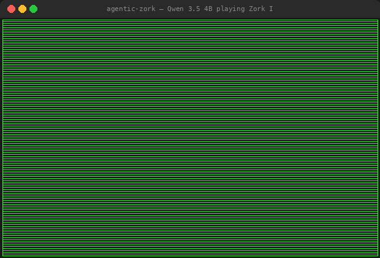

<h1 align="center">Agentic Zork</h1>

<p align="center">
  
</p>

An LLM agent that plays classic text adventure games (Zork, Lost Pig, Advent, etc.) using the [Model Context Protocol (MCP)](https://modelcontextprotocol.io/) and a ReAct reasoning loop.

The agent connects to a game server over MCP's stdio transport, reasons about what to do via chain-of-thought prompting, and sends commands to Z-machine games through the [Jericho](https://github.com/microsoft/jericho) framework. It supports two modes:

- **Cloud**: Qwen2.5-72B-Instruct via the HuggingFace Inference API
- **Local**: Qwen 3.5 4B (or any Ollama model) running entirely on your machine

```
src/agent.py  ◄── MCP (stdio) ──►  src/mcp_server.py  ◄── Jericho ──►  .z5 game file
                  │
               src/_va_worker.py  (subprocess)

local_runner/run_local.py  ◄── Ollama API ──►  local LLM
        │
        └── Jericho (direct)  ──►  .z5 game file
```

## Quick Start

```bash
# Clone, install
git clone <repo-url> && cd agentic-zork

python -m venv .venv
source .venv/bin/activate   # Linux/macOS
pip install -r requirements.txt

# Set your HuggingFace token
cp .env.example .env
# Edit .env and add your HF_TOKEN (needs access to Qwen2.5-72B-Instruct)

# Play Lost Pig
python src/run_agent.py -v
python src/run_agent.py -g zork1 -v

# Evaluate over multiple trials
python evaluation/evaluate.py -s . -g lostpig -t 3 -v
```

### Local Mode (no API key needed)

Run the agent entirely on your machine with [Ollama](https://ollama.com/):

```bash
# Install Ollama and pull a model
ollama pull qwen3.5:4b

# Play Zork 1 locally (50 steps)
python local_runner/run_local.py --game zork1 --steps 50

# Play Lost Pig with a different model
python local_runner/run_local.py --game lostpig --model qwen3.5:4b --steps 30

# Save a game log as JSON
python local_runner/run_local.py --game zork1 --output assets/my_run.json
```

The local runner is a full port of the cloud agent — it includes valid actions extraction, per-room exploration tracking, loop detection, promising actions, and error recovery.

## How It Works

The agent runs a **ReAct loop**: observe → think → act → repeat. At each step the LLM gets the game text, score, history, and valid actions, then outputs a `THOUGHT:` + `ACTION:` pair. The action is sent to the game via MCP and the cycle continues.

**MCP tools** exposed by the server: `play_action`, `memory`, `get_map`, `inventory`, `valid_actions`. Each action response includes a `[Location: name|id]` tag from Jericho so the agent always knows where it is.

**Valid actions** come from Jericho's `get_valid_actions()`, which can block for 60s+. A dedicated subprocess (`src/_va_worker.py`) handles this with `signal.alarm` timeouts so the async server never freezes. If the worker hangs it gets killed and respawned automatically.

**Loop detection** catches two patterns: single-action repeats (e.g. `examine` × 3) and two-action cycles (A→B→A→B). When detected, the agent re-prompts the LLM with the banned actions and valid alternatives instead of picking randomly.

**Per-room exploration** tracks actions tried, exits used, and promising interactions (extracted by a secondary LLM call on room entry). After 8 steps in the same room the prompt nudges the agent to move on.

**Tool call validation** catches when the LLM writes game verbs as tool names (e.g. `TOOL: examine` instead of `play_action`) and fixes them automatically. It also maps invalid verbs like `grab` → `take`.

## Evaluation

Run multiple trials to get score statistics:

```bash
# 3 trials on Lost Pig
python evaluation/evaluate.py -s . -g lostpig -t 3

# 5 trials on Zork 1 with verbose output, save results
python evaluation/evaluate.py -s . -g zork1 -t 5 -v -o results.json

# List all available games
python evaluation/evaluate.py --list-games
```

The evaluation framework runs each trial with a different seed for reproducibility and reports mean/std/min/max scores.
